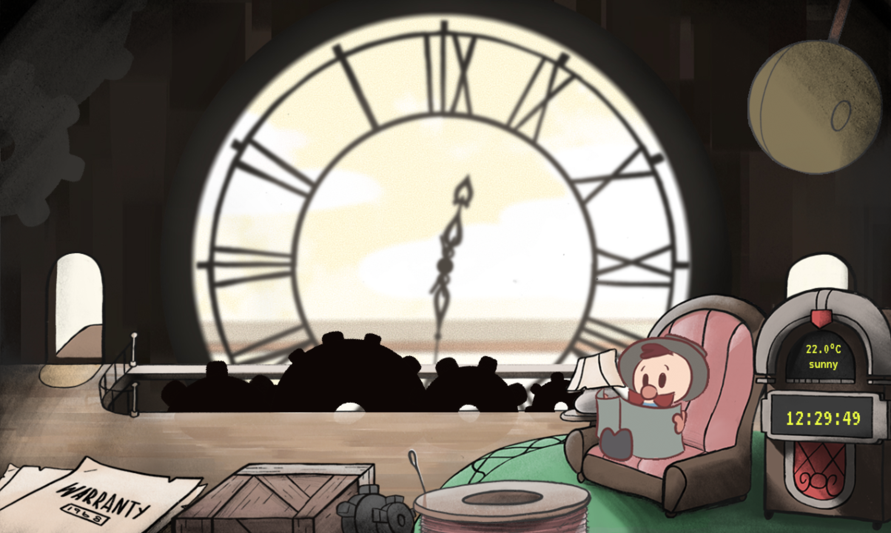

# Digital Clock

Our entry in the Flutter Clock Challenge is a fun glimpse from the inside looking out of a quaint cuckoo-clock.
Meet ‘Tock’, the caretaker of this particular timekeeper. Every hour he hurries outside to sound the arrival of
another successful trip around the clock’s face. In his downtime, he enjoys to read his newspaper, as well as
other activities that will be added during continued development.

These activities will vary depending on the time of day. Tock may appear groggy in the early morning,
chipper in the afternoon, and disturbed from sleep late at night (he may even sleep walk).

We hope you enjoy our little ‘art-clock’ as you follow its continued development

